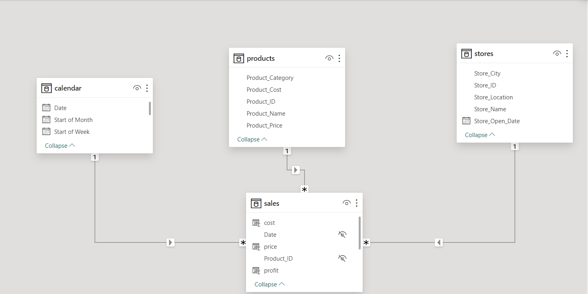
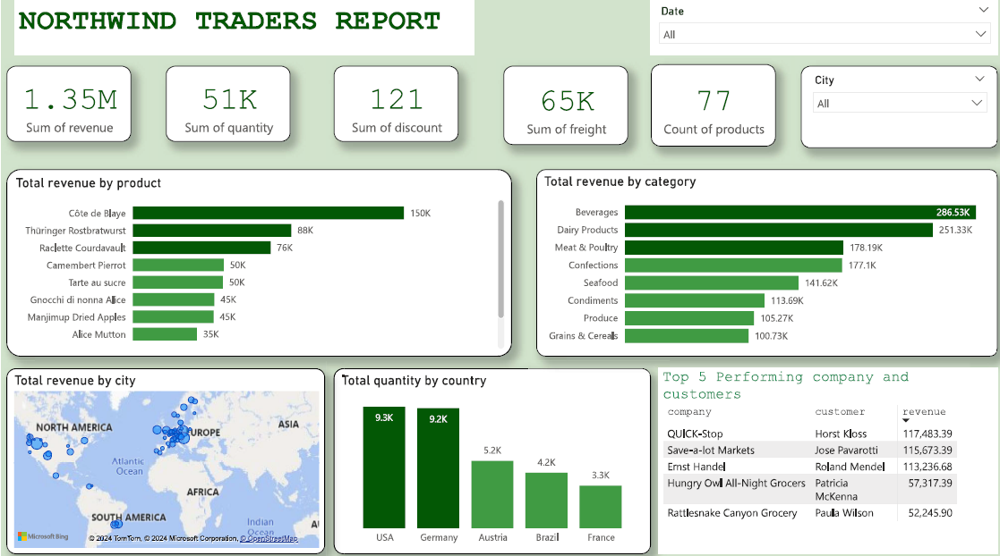
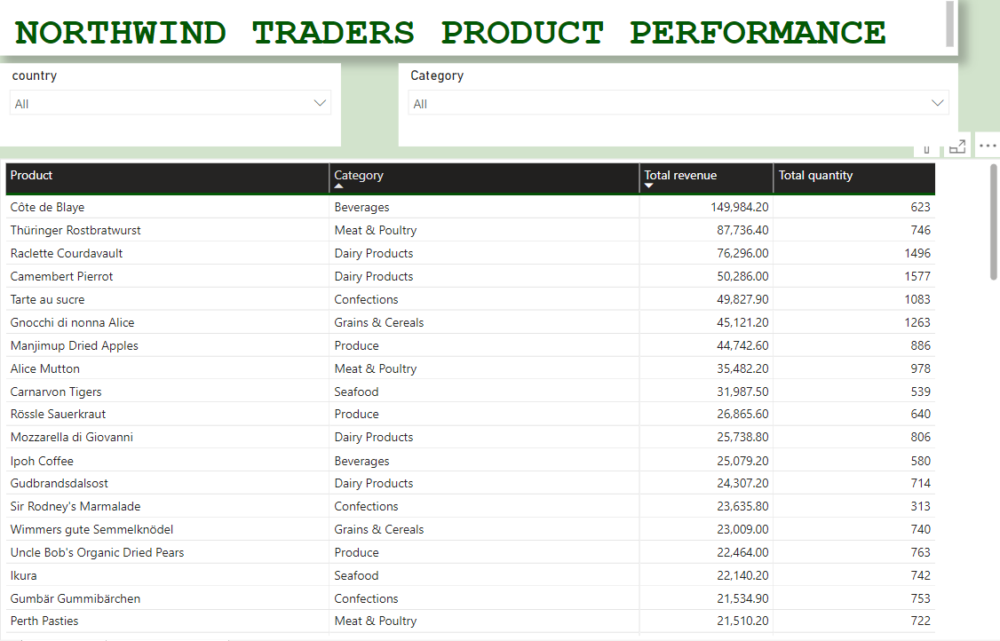

## North Wind Trade-Report-Power-BI

## INTRODUCTION

The North wind Traders Sales Analysis project aims to provide a comprehensive understanding of sales performance, trader insights within the North wind Traders Company. The project delves into key aspects such as product categories, geographic sales distribution, employee performance and product performance. The project answers crucial questions and help the company make data driven decisions.
 
## OBJECTIVES
Sales Performance Analysis:
-Analyse the sales data to identify trends, Top products, and high-performing product categories.
-Geographic Sales Distribution: 
-Analyze sales distribution across different countries to  identify potential growth opportunities.

## PROBLEM STATEMENT
1.	Which product has the highest revenue?
2.	What product category has the highest revenue?
3.	What is the total Revenue by location?
4.	What is the total quantity by country?
5.	what is the top 5 performing customers and companies?

## SKILLS DEMONSTRATED
Microsoft Power BI skills featured include:
-  DAX,
-  Modelling,
-  Quick measure,

## Modelling

The model is a star schema
There are a 4-dimension tables. The tables are joined to the table with a one-to-many relationship on the primary key.

## VISUALISATION - TRADER REPORT

Data visualization is essential, as the grahical representation of data sets provides context to our data and allows us to visualze trends and patterns much more easily. These dashboards will provide essential KPIs, charts and tables which measure the progress of the business in generating sales and revenue.

The visualisation shows charts and table that include,total revenue by product category, total revenue by location, total quantity by city, Top 5 performing customers and companies.
KPIs include sum of revenue, count of products, sum of discount, sum of freight.

## VISUALISATION - PRODUCT PERFORMANCE

Product Performance visualisation shows products with their corressponding revenues, quantity and product category.

## KEY FINDINGS
The highest total revenue by category is BEVERAGES with a total of 286.53k, followed by DAIRY PRODUCT with total of 251.53k and then MEAT AND POULTRY with 178.19k dollars. The lowest category by revenue is GRAINS AND CEREAL with 100.73k dollars.

Total Quantity by country, USA quantity is 9.3k followed by Germany and Austria with 9.2k and 5.3k respectively

The top performing company is QUICK STOP with 117k in revenue and the top performing Customer is HORST KLAUSS

## INTERACTIVITY 

😃You can interact with the report [HERE](https://app.powerbi.com/view?r=eyJrIjoiZDcwY2EzMzQtNDNmNS00Nzk4LTgxMDAtMTQyMjdiZGVmMzA5IiwidCI6IjU0MzUwMDM0LWVhYTMtNGMyZC1hYmZhLTY0MGRmMDYyNjNhOCJ9)

Users can filter data by product category, country, date to focus on specific aspects of the sales performance.

## Conclusion
The North wind Traders Sales Analysis project provides valuable insights into sales performance, product performance enabling informed decision-making and strategic planning for business growth and success.
Management should focus more on those products that contribute to high sales and also how to increase sales revenue

## THANK YOU

